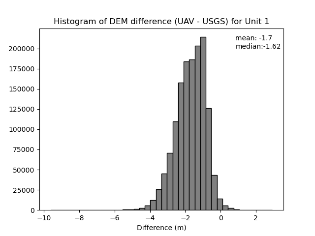
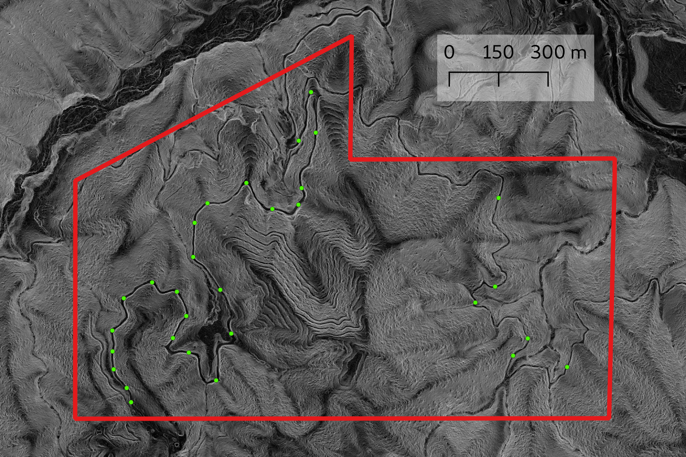
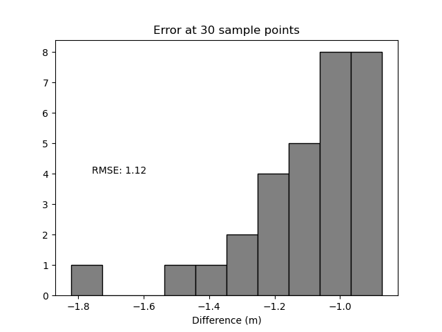

# `ortho-process` | Tools for Processing Small GSD Photogrammetric Pointclouds 

# UAV ortho processing workflow #

This workflow begins with the vendor supplied point cloud and works through classification and quality control for the dataset. It is assumed that the vendor has provided a photogrammetric point cloud with RGB fields, a DSM and an orthoimage.  We also will need OGR readable vectors of the unit boundary and some sample points for testing. In this example we will be working in the directory `Unit_1` and the file contained therein are:
+ `unit1ppk_20220926_20230226-dense_point_cloud.laz`
+ `unit1ppk_20220926_20230226-dsm.tiff`
+ `unit1ppk_20220926_20230226-orthomosaic.tiff`
+ `unit_1_boundary.gpkg`


The first step will be to classify the point cloud and create a DEM.  The script, `classify_burn_chunks_VARI.py` takes a copc as input then calculates the Visible Atmospherically Resistant Index (VARI) for each point and classifies anything above the provided threshold as vegetation.  The classified point cloud is written as tiles into a new subdirectory.  A DEM is created from the minimum value of the ground returns within a pixel and written as tiles to a subdirectory. For more information on choosing an appropriate value see Choosing VARI Threshold section below. 

:
+ Create a copc from the laz/las file. An easy way to do so is to open the laz/s file in QGIS, it will build a copc next to the source file in its directory.
+ Start an appropriate conda or virtual env.
+ Classify the point cloud using  `python classify_burn_chunks_VARI.py --infile=$LAZ --vari_thresh=0.0100932` where the variable `$LAZ` is the path to the copc file made in the previous step.  The parameter `--vari_thresh` is the threshold of the Visible Atmospherically Resistant Index above which points will be classed as vegetation. Use `python classify_burn_chunks_VARI.py -h` for other options.
+ After the above steps there will be two new directories next to the original laz/s file. Enter the directory `tiled_las_vari_0` and make a vrt using `gdalbuildvrt dem_0p5_vari_0.vrt *.tif`.

Now the contents of the directory should look like this:
```
|__Unit_1__
           |__unit_1_boundary.gpkg
           |__unit_1_sample_points.gpkg
           |__unit1ppk_20220926_20230226-dense_point_cloud.laz
           |__unit1ppk_20220926_20230226-dense_point_cloud.copc.laz
           |__tiled_dem_0p5_vari_0__
           |                        |__0_0.laz
           |                        |__0_1.laz
           |                        |__...
           |                        |__n_m.laz
           |
           |__tiled_las_vari_0__
                                |__dem_0p5_vari_0.vrt
                                |__0_0.tif
                                |__0_1.tif
                                |__...
                                |__n_m.tif
```

At this point it is a good idea to inspect the output DEM and compare to USGS 3DEP data if available.  A helpful comparison is to compare the DEM difference between the two in a pixel by pixel basis.
```
gdalwarp -of GTIFF \
    -tr 1.0 1.0 \
    -tap \
    -cutline unit_1_boundary.gpkg \
    -crop_to_cutline \
    -co TILED=YES \
    tiled_las_vari_0/dem_0p5_vari_0.vrt \
    unit_1_dem_0p5_vari_1m.tif

gdalwarp -of GTIFF \
    -tr 1.0 1.0 \
    -tap \
    -cutline unit_1_boundary.gpkg \
    -crop_to_cutline \
    -co TILED=YES \
    path/to/USGS/opr_DEM.vrt \
    unit_1_dem_opr_1m.tif

gdal_calc.py --calc='A-B' --outfile=unit_1_diff.tif -A unit_1_dem_0p5_vari_1m.tif -B unit_1_dem_opr_1m.tif
```
The above code block also provides us with a 1m resolution version of the DEM (trimmed to the unit boundary) If we look at the histogram of pixel values for `unit_1_dem_opr_1m.tif` it looks like this.



Which is not bad.  This, of course,  reflects vegetation that made it through the VARI filter and any actual change in ground surface that has occurred.  To get a more focused look at the actual difference we will look at 30 points positioned on road surfaces.  Ideally these would be on paved roads, but the AOI has no paved roads, so we wil have to use dirt roads.  Here is a picture of the sample points found in `unit_1_sample_points.gpkg` and the unit boundary over a slope map from the USGS 3DEP data.

 

We can sample the points using `src/sample_hist.py`. in this case it produces

 

As a final step it is nice to merge the laz tiles and make a copc.  To merge the files one could use `pdal merge` but it seems that it does not work in streaming mode, which can be a problem for large files.  As far as I can tell there is no way to keep extra dimensions.  When we ran `classify_burn_chunks_VARI.py` it added the dimensions `HeightAboveGround` and `VARI`, which it would be nice to keep.  `src/merge_laz.py` will merge the tiles in streaming mode and is capable of keeping extra dims.  It merges the laz files into a single laz.  Unfortunately PDAL's `writers.copc` does not support streaming (or extra dimensions?) at this time, so `merge_laz.py` has to write a regular laz. 

```
python src/merge_laz.py \
    --indir=tiled_las_vari_0 \
    --outfile=unit1ppk_20220926_20230226-dense_point_cloud_classified.laz \
    --extra_dims='VARI=double,HeightAboveGround=double'
```

This will deposit `unit1ppk_20220926_20230226-dense_point_cloud_classified.laz` into the `Unit_1` directory.  Open it with QGIS and you will then have the following final directory structure.

```
|__Unit_1__
           |__unit_1_boundary.gpkg
           |__unit_1_sample_points.gpkg
           |__unit1ppk_20220926_20230226-dense_point_cloud.laz
           |__unit1ppk_20220926_20230226-dense_point_cloud.copc.laz
           |__unit_1_dem_0p5_vari_1m.tif
           |__unit_1_dem_opr_1m.tif
           |__unit_1_dem_opr_1m.tif
           |__unit1ppk_20220926_20230226-dense_point_cloud_classified.laz
           |__unit1ppk_20220926_20230226-dense_point_cloud_classified.copc.laz
           |__tiled_dem_0p5_vari_0__
           |                        |__0_0.laz
           |                        |__0_1.laz
           |                        |__...
           |                        |__n_m.laz
           |
           |__tiled_las_vari_0__
                                |__dem_0p5_vari_0.vrt
                                |__0_0.tif
                                |__0_1.tif
                                |__...
                                |__n_m.tif
```

# Details of `classify_burn_chunks_VARI.py`

This script uses several filters from PDAL. The cloth simulation filter (Zhang et al., 2016) is used to classify ground points.  Height above ground (HAG) is calculated using the `hag_nn` filter, with 4 nearest neighbors. Next,  Visible Atmospherically Resistant Index (VARI, Gitelson et al., 2002) is calculated for each point

$$
\mathrm{VARI} = \frac{Green - Red}{Green + Red - Blue}
$$

Points with VARI above a given threshold are classified as vegetation.  Vegetation is then reclassified as Low, medium or high based on HAG.

# Choosing VARI Threshold

The VARI threshold used in the example was determined by manually segmenting chunks of bush and bare ground in cloud compare.  A Normal distribution was then fit to the histogram of VARI values for each chunk.  The threshold was was calculated as the midpoint between 2 standard deviations below the mean for the bush group and 2 standard deviations above the ground group.

$$
V_{thresh} = \frac{(\theta_{bush} - 2 \times \sigma_{bush}) + (\theta_{ground} - 2 \times \sigma_{ground})} {2} 
$$

This yielded  a $V_{thresh}$ value of 0.0100932.

The landscape in the example was severely  burned two years before the UAV imagery was collected. The vegetation on the landscape is fairly simple, mostly scrub growing on bare ground. In some cased determining thresholds may be more complex.  Even in this simple case, dead vegetation is not filtered, but most of it was removed based on height above ground.


# Credits

otho-process is created and maintained by [Michael Huggins](https://github.com/kulpojke), on behalf of the [Watershed Research and Training Center](https://www.thewatershedcenter.com/).

The [COPC](https://copc.io/) file format is created and maintained by HOBU Inc. Code relies on [PDAL](https://github.com/PDAL/PDAL) which is maintained by HOBU Inc.

# References
Gitelson, A.A., Kaufman, Y.J., Stark, R. and Rundquist, D., 2002. _Novel algorithms for remote estimation of vegetation fraction_. Remote sensing of Environment, 80(1), pp.76-87.

PDAL Contributors, 2020. PDAL Point Data Abstraction Library. doi:10.5281/zenodo.2556737

Zhang, Wuming, et al., 2016. _An easy-to-use airborne LiDAR data filtering method based on cloth simulation_. Remote Sensing, 8.6, 501.